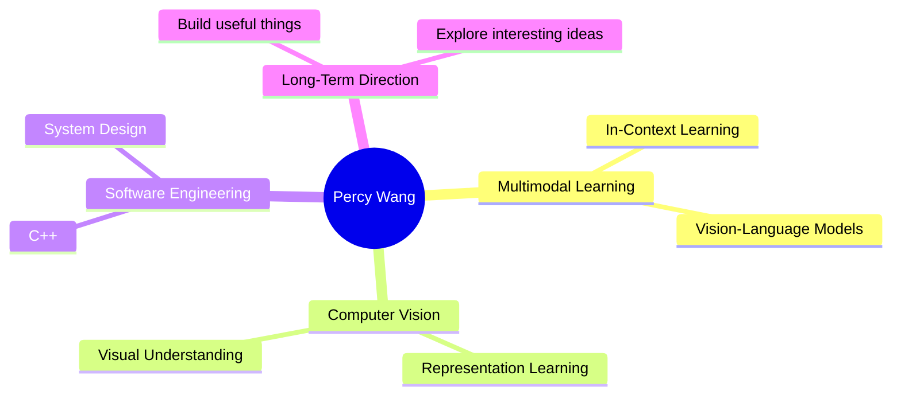

<div align="center">


<br />


</div>

---

## `> whoami`

```txt
Name        : Percy Wang
Role        : AI Learner / Student
Major       : Computer Science and Technology / Marketing
Research    : Multimodal In-Context Learning, Computer Vision
Interest    : Interesting ideas worth building
Motto       : 每一天都很珍贵，坚持让理想走更远。
Contact     : tianqip3342@gmail.com
```

Hi, I'm Percy Wang. I am exploring the intersection of multimodal learning, computer vision, and meaningful software systems.

你好，我是 Percy Wang。正在学习与研究多模态上下文学习、计算机视觉，以及那些真正有意思、值得做出来的方向。

---

## `> current_stack`

<div align="center">


</div>

---

## `> research_signal`



---

## `> github_status`

<div align="center">


<br />
<br />


</div>

---

## `> contribution_grid`

<div align="center">

<picture>
  <source media="(prefers-color-scheme: dark)" srcset="https://raw.githubusercontent.com/tianqip-jilin/tianqip-jilin/output/github-contribution-grid-snake-dark.svg" />
  <source media="(prefers-color-scheme: light)" srcset="https://raw.githubusercontent.com/tianqip-jilin/tianqip-jilin/output/github-contribution-grid-snake.svg" />
  
</picture>

</div>

---

## `> connect`

<div align="center">

[](mailto:tianqip3342@gmail.com)
[](https://github.com/tianqip-jilin)

</div>

<div align="center">

```txt
while (alive) {
  learn();
  build();
  think();
  go_further();
}
```

</div>
